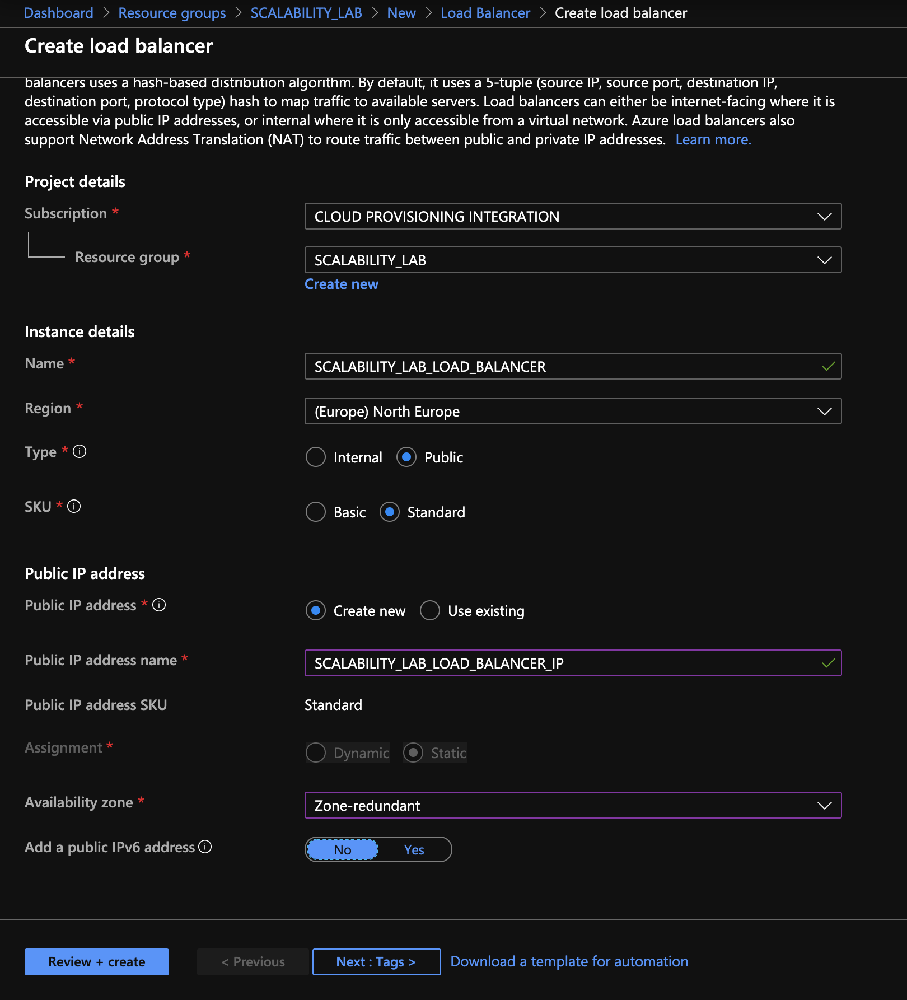
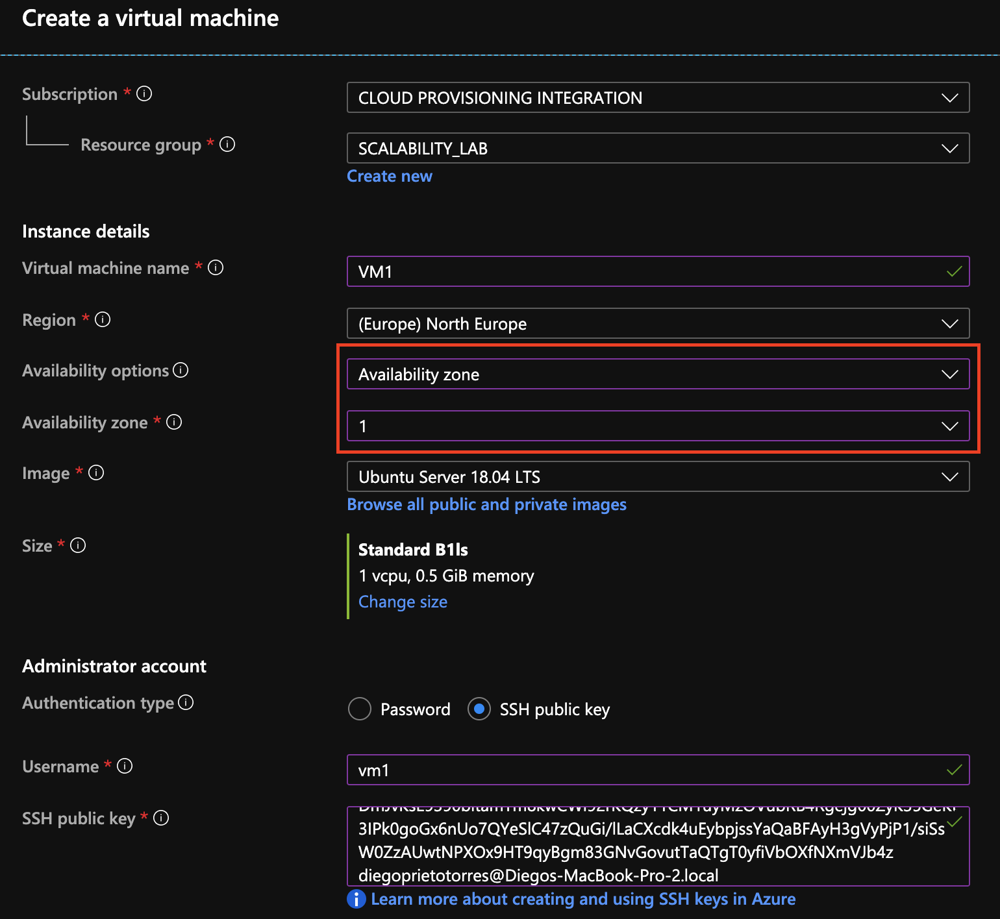

### Escuela Colombiana de Ingeniería
### Arquitecturas de Software - ARSW
### Desarrollado por Laura Natalia Rojas y Ana Maria Duran
---

## Escalamiento en Azure con Maquinas Virtuales, Sacale Sets y Service Plans

### Dependencias
* Cree una cuenta gratuita dentro de Azure. Para hacerlo puede guiarse de esta [documentación](https://azure.microsoft.com/es-es/free/students/). Al hacerlo usted contará con $100 USD para gastar durante 12 meses.

### Parte 0 - Entendiendo el escenario de calidad

Adjunto a este laboratorio usted podrá encontrar una aplicación totalmente desarrollada que tiene como objetivo calcular el enésimo valor de la secuencia de Fibonnaci.

**Escalabilidad**
Cuando un conjunto de usuarios consulta un enésimo número (superior a 1000000) de la secuencia de Fibonacci de forma concurrente y el sistema se encuentra bajo condiciones normales de operación, todas las peticiones deben ser respondidas y el consumo de CPU del sistema no puede superar el 70%.

### Parte 1 - Escalabilidad vertical

1. Diríjase a el [Portal de Azure](https://portal.azure.com/) y a continuación cree una maquina virtual con las características básicas descritas en la imágen 1 y que corresponden a las siguientes:
    * Resource Group = SCALABILITY_LAB
    * Virtual machine name = VERTICAL-SCALABILITY
    * Image = Ubuntu Server 
    * Size = Standard B1ls
    * Username = scalability_lab
    * SSH publi key = Su llave ssh publica


a. Creamos una llave SSH.


b. Creamos la máquina virtual.


c. Finalizamos la creación 


2. Para conectarse a la VM use el siguiente comando, donde las `x` las debe remplazar por la IP de su propia VM (Revise la sección "Connect" de la virtual machine creada para tener una guía más detallada).

    `ssh scalability_lab@xxx.xxx.xxx.xxx`

* Conexión:

   


3. Instale node, para ello siga la sección *Installing Node.js and npm using NVM* que encontrará en este [enlace](https://linuxize.com/post/how-to-install-node-js-on-ubuntu-18.04/).

* Installing NVM (Node Version Manager) script

   

* Installation of Curl Utility on Debian

   

   

* Verificamos la instalación

   


4. Para instalar la aplicación adjunta al Laboratorio, suba la carpeta `FibonacciApp` a un repositorio al cual tenga acceso y ejecute estos comandos dentro de la VM:

    `git clone <your_repo>`

    `cd <your_repo>/FibonacciApp`

    `npm install`

   * Instalación de npm en la VM:
     

5. Para ejecutar la aplicación puede usar el comando `npm FibinacciApp.js`, sin embargo una vez pierda la conexión ssh la aplicación dejará de funcionar. Para evitar ese compartamiento usaremos *forever*. Ejecute los siguientes comando dentro de la VM.

    ` node FibonacciApp.js`

   * Instalamos forever para que el proceso se ejecute en segundo plano.
     
     

     


6. Antes de verificar si el endpoint funciona, en Azure vaya a la sección de *Networking* y cree una *Inbound port rule* tal como se muestra en la imágen. Para verificar que la aplicación funciona, use un browser y user el endpoint `http://xxx.xxx.xxx.xxx:3000/fibonacci/6`. La respuesta debe ser `The answer is 8`.


   * Probamos
     
     

   * Corremos el ejecutable

     


   * Verificamos el funcionamiento
     
     


7. La función que calcula en enésimo número de la secuencia de Fibonacci está muy mal construido y consume bastante CPU para obtener la respuesta. Usando la consola del Browser documente los tiempos de respuesta para dicho endpoint usando los siguintes valores:
    * 1000000
  
      

    * 1010000

      

    * 1020000

      

    * 1030000
  
      

    * 1040000
  
      

    * 1050000
  
      

    * 1060000
  
      

    * 1070000
  
      

    * 1080000
  
      

    * 1090000
  
      


8. Dírijase ahora a Azure y verifique el consumo de CPU para la VM. (Los resultados pueden tardar 5 minutos en aparecer).


* El consumo alcanza el 60%

   


9. Ahora usaremos Postman para simular una carga concurrente a nuestro sistema. Siga estos pasos.
    * Instale newman con el comando `npm install newman -g`. Para conocer más de Newman consulte el siguiente [enlace](https://learning.getpostman.com/docs/postman/collection-runs/command-line-integration-with-newman/).

      

    * Diríjase hasta la ruta `FibonacciApp/postman` en una maquina diferente a la VM.
    * Para el archivo `[ARSW_LOAD-BALANCING_AZURE].postman_environment.json` cambie el valor del parámetro `VM1` para que coincida con la IP de su VM.
    * Ejecute el siguiente comando.
      ```
       newman run ARSW_LOAD-BALANCING_AZURE.postman_collection.json -e [ARSW_LOAD-BALANCING_AZURE].postman_environment.json -n 10 &
       newman run ARSW_LOAD-BALANCING_AZURE.postman_collection.json -e [ARSW_LOAD-BALANCING_AZURE].postman_environment.json -n 10
       ```
       
       *  Resultados:
         
          

          


10. La cantidad de CPU consumida es bastante grande y un conjunto considerable de peticiones concurrentes pueden hacer fallar nuestro servicio. Para solucionarlo usaremos una estrategia de Escalamiento Vertical. En Azure diríjase a la sección *size* y a continuación seleccione el tamaño `B2ms`.


11. Una vez el cambio se vea reflejado, repita el paso 7, 8 y 9.

    * 1000000

      

    * 1010000

      


    * 1020000

      


    * 1030000
  
      

    * 1040000
  
      


    * 1050000
  
      


    * 1060000
  
      


    * 1070000
  
      


    * 1080000
  
      


    * 1090000
  
      

   * El consumo alcanzó el 43%
     
     

   * Primeras 10 iteraciones

     

   * Segundas 10 iteraciones

     


12. Evalue el escenario de calidad asociado al requerimiento no funcional de escalabilidad y concluya si usando este modelo de escalabilidad logramos cumplirlo.

   Respuesta: Se logró reducir el consumo a un 43%.
   
13. Vuelva a dejar la VM en el tamaño inicial para evitar cobros adicionales.

**Preguntas**

1. ¿Cuántos y cuáles recursos crea Azure junto con la VM?
   * La Máquina Virtual, Dirección IP Pública, Grupo de Seguridad de Red, Red virtual, Interfaz de red, Disco y la Clave SSH.
2. ¿Brevemente describa para qué sirve cada recurso?
   - **Máquina Virtual (VM)**:
       - Es la instancia de procesamiento en la que se ejecutan las aplicaciones, sistemas operativos y servicios. Proporciona el entorno de cómputo que necesita tu aplicación.
   - **Dirección IP Pública**:
       - Permite que tu VM sea accesible desde Internet. Es útil si deseas acceder a la VM desde fuera de la red de Azure, por ejemplo, para conectarte a través de SSH o acceder a servicios web.
   - **Grupo de Seguridad de Red (NSG)**:
       - Controla el tráfico entrante y saliente a la VM mediante reglas de firewall. Puedes definir qué puertos son accesibles desde Internet o desde otras redes en Azure, protegiendo tu VM de accesos no deseados.
   - **Red Virtual (VNet)**:
       - Es una red privada en Azure que conecta tus recursos (como VMs, bases de datos, etc.) de forma segura. Permite la comunicación entre recursos dentro de la misma red sin exponerlos a Internet.
   - **Interfaz de Red (NIC)**:
       - Es el componente que conecta la VM a la red, permitiéndole comunicarse con otros recursos y con Internet si tiene una IP pública. Cada VM tiene al menos una NIC para gestionar sus conexiones de red.
   - **Disco**:
       - Es el almacenamiento de la VM. Incluye el disco del sistema operativo (OS) que contiene el sistema operativo de la VM, y puede haber discos adicionales para almacenar datos o configuraciones de la aplicación.
   - **Clave SSH**:
       - Es un par de claves públicas y privadas utilizadas para la autenticación al conectarse a la VM de manera segura a través de SSH (Secure Shell). Permite acceder a la máquina sin necesidad de usar contraseñas, lo cual es más seguro.
      
3. ¿Al cerrar la conexión ssh con la VM, por qué se cae la aplicación que ejecutamos con el comando `npm FibonacciApp.js`? ¿Por qué debemos crear un *Inbound port rule* antes de acceder al servicio?
   * Cuando nos conectamos usando SSH y ejecutamos la aplicación, se ejecuta en el contexto de la sesión. Esto significa que al cerrar la conexión SSH, el proceso dentro de la aplicación también se detiene porque está vinculada a la sesión. Creamos un Inbound port rule para permitir el tráfico de red entre la VM desde el exterior. Así configuramos que el servicio pueda ser accesible.
     
4. Adjunte tabla de tiempos e interprete por qué la función tarda tando tiempo.

   

   En la función getNthNumberInSequence de FibonacciService, el cálculo de los números de Fibonacci puede ser extremadamente lento. La complejidad de tiempo es exponencial, específicamente O(2^n). Esto significa que con cada aumento en el valor de n, el tiempo de cálculo se duplica aproximadamente, lo que causa un incremento muy alto en los tiempos de respuesta. En la tabla "Antes de Escalabilidad", se observa que los tiempos crecen de manera considerable, alcanzando valores de más de 10 segundos para endpoints más altos.

5. Adjunte imágen del consumo de CPU de la VM e interprete por qué la función consume esa cantidad de CPU.

   
   

   La función getNthNumberInSequence utiliza una gran cantidad de CPU debido a que ejecuta varias operaciones de suma sobre números de gran tamaño, lo que resulta ser muy demandante en términos de cálculos. A medida que los números aumentan, las operaciones implican manipular muchos dígitos y realizar cálculos a nivel de bits, lo que requiere un número significativo de ciclos de CPU.
   
6. Adjunte la imagen del resumen de la ejecución de Postman. Interprete:


   Con escabilidad.
   
    * Tiempos de ejecución de cada petición.
  
      
      
      

      Las 10 iteraciones tuvieron un tiempo de respuesta promedio de 9.2 segundos, el mínimo fue de 8.9s, el máximo de 9.5s, con una desviación estándar de 179ms. Esto indica que el sistema tiene un comportamiento bastante consistente en cuanto a tiempos de respuesta, con una ligera variabilidad, lo que podría ser un signo de estabilidad en el rendimiento bajo las condiciones actuales de carga.
      
    * Si hubo fallos documentelos y explique.

      Encontramos 1 error de conexión, ECONNRESET en la iteración 4. Este error se presenta cuando la conexión de red ocurre de forma inesperada. Se cerró la conexión antes de que se pudiera completar la solicitud, lo que puede indicar que el consumo de la CPU este siendo muy alto.

      
7. ¿Cuál es la diferencia entre los tamaños `B2ms` y `B1ls` (no solo busque especificaciones de infraestructura)?

   - **B2ms**: Es una VM de gama media con 2 núcleos de CPU, 8GB de RAM y discos más rápidos. Es adecuada para aplicaciones de tamaño mediano que requieren mayor capacidad de procesamiento y memoria.
   - **B1ls**: Es una VM de nivel básico con solo 1 núcleo de CPU y 1GB de RAM. Es adecuada para aplicaciones pequeñas o para pruebas de desarrollo donde los recursos no son una gran preocupación.
     **Diferencia clave**: No solo es la infraestructura (CPU, RAM), sino que también el rendimiento general, como la capacidad para manejar múltiples conexiones y realizar cálculos más complejos. B2ms es más adecuado para aplicaciones de producción, mientras que B1ls es más económico y adecuado para pruebas.
     
8. ¿Aumentar el tamaño de la VM es una buena solución en este escenario?, ¿Qué pasa con la FibonacciApp cuando cambiamos el tamaño de la VM?

   Aumentar el tamaño de la VM puede ser una solución temporal si el problema es que la aplicación necesita más recursos (CPU, RAM). Sin embargo, esto no garantiza una mejora significativa si el problema está en el algoritmo de la función (por ejemplo, una implementación ineficiente de Fibonacci). También, aumentar el tamaño de la VM podría aumentar el costo.
   
9. ¿Qué pasa con la infraestructura cuando cambia el tamaño de la VM? ¿Qué efectos negativos implica?
   Cuando cambias el tamaño de una VM en Azure, la infraestructura se ajusta para darle más o menos recursos, lo cual requiere apagar y reiniciar la VM, causando una breve interrupción en el servicio.

      * Interrupción temporal: La VM se apaga y se reinicia, pausando cualquier servicio que esté en ejecución.
      * Rendimiento variable: Una VM más grande mejora el rendimiento, pero reducir el tamaño podría ralentizar la aplicación.
      * Costos adicionales: Aumentar el tamaño de la VM cuesta más dinero.
      * Ineficiencia en cargas variables: Si el tamaño es muy grande para ciertas cargas, se malgastan recursos.
      * Límite de escalabilidad: Solo puedes escalar verticalmente hasta el tamaño máximo que permite Azure, lo cual es limitado.
      * Dependencia de una sola VM: Toda la carga depende de una VM. Si falla, el servicio entero se ve afectado.

10. ¿Hubo mejora en el consumo de CPU o en los tiempos de respuesta? Si/No ¿Por qué?
   Los resultados demuestran una notable optimización en el rendimiento general del sistema. Al migrar de una instancia B1ls a una B2ms, se evidencia una significativa mejora tanto en la eficiencia del procesamiento como en la velocidad de respuesta.
Esta mejora se atribuye principalmente a las capacidades superiores que ofrece la instancia B2ms, específicamente:

   * Mayor potencia de procesamiento gracias a sus núcleos adicionales
   * Incremento sustancial en la memoria RAM disponible
   * Capacidad de almacenamiento expandida

11. Aumente la cantidad de ejecuciones paralelas del comando de postman a `4`. ¿El comportamiento del sistema es porcentualmente mejor?

      El uso de la GPU aumentó significativamente. Fallaron 9 solicitudes.

### Parte 2 - Escalabilidad horizontal

#### Crear el Balanceador de Carga

Antes de continuar puede eliminar el grupo de recursos anterior para evitar gastos adicionales y realizar la actividad en un grupo de recursos totalmente limpio.

1. El Balanceador de Carga es un recurso fundamental para habilitar la escalabilidad horizontal de nuestro sistema, por eso en este paso cree un balanceador de carga dentro de Azure tal cual como se muestra en la imágen adjunta.




2. A continuación cree un *Backend Pool*, guiese con la siguiente imágen.


3. A continuación cree un *Health Probe*, guiese con la siguiente imágen.


4. A continuación cree un *Load Balancing Rule*, guiese con la siguiente imágen.


5. Cree una *Virtual Network* dentro del grupo de recursos, guiese con la siguiente imágen.


#### Crear las maquinas virtuales (Nodos)

Ahora vamos a crear 3 VMs (VM1, VM2 y VM3) con direcciones IP públicas standar en 3 diferentes zonas de disponibilidad. Después las agregaremos al balanceador de carga.

1. En la configuración básica de la VM guíese por la siguiente imágen. Es importante que se fije en la "Avaiability Zone", donde la VM1 será 1, la VM2 será 2 y la VM3 será 3.




2. En la configuración de networking, verifique que se ha seleccionado la *Virtual Network*  y la *Subnet* creadas anteriormente. Adicionalmente asigne una IP pública y no olvide habilitar la redundancia de zona.


3. Para el Network Security Group seleccione "avanzado" y realice la siguiente configuración. No olvide crear un *Inbound Rule*, en el cual habilite el tráfico por el puerto 3000. Cuando cree la VM2 y la VM3, no necesita volver a crear el *Network Security Group*, sino que puede seleccionar el anteriormente creado.


4. Ahora asignaremos esta VM a nuestro balanceador de carga, para ello siga la configuración de la siguiente imágen.


5. Finalmente debemos instalar la aplicación de Fibonacci en la VM. para ello puede ejecutar el conjunto de los siguientes comandos, cambiando el nombre de la VM por el correcto

```
git clone https://github.com/daprieto1/ARSW_LOAD-BALANCING_AZURE.git

curl -o- https://raw.githubusercontent.com/creationix/nvm/v0.34.0/install.sh | bash
source /home/vm1/.bashrc
nvm install node

cd ARSW_LOAD-BALANCING_AZURE/FibonacciApp
npm install

npm install forever -g
forever start FibonacciApp.js
```


Realice este proceso para las 3 VMs, por ahora lo haremos a mano una por una, sin embargo es importante que usted sepa que existen herramientas para aumatizar este proceso, entre ellas encontramos Azure Resource Manager, OsDisk Images, Terraform con Vagrant y Paker, Puppet, Ansible entre otras.

- VM2

   
   
   
   
   
   
   
   
   
   
   
   
   

- VM3

  

  

  

  

  

  

  

  


#### Probar el resultado final de nuestra infraestructura

1. Porsupuesto el endpoint de acceso a nuestro sistema será la IP pública del balanceador de carga, primero verifiquemos que los servicios básicos están funcionando, consuma los siguientes recursos:

```
http://52.155.223.248/
http://52.155.223.248/fibonacci/1
```


2. Realice las pruebas de carga con `newman` que se realizaron en la parte 1 y haga un informe comparativo donde contraste: tiempos de respuesta, cantidad de peticiones respondidas con éxito, costos de las 2 infraestrucruras, es decir, la que desarrollamos con balanceo de carga horizontal y la que se hizo con una maquina virtual escalada.


3. Agregue una 4 maquina virtual y realice las pruebas de newman, pero esta vez no lance 2 peticiones en paralelo, sino que incrementelo a 4. Haga un informe donde presente el comportamiento de la CPU de las 4 VM y explique porque la tasa de éxito de las peticiones aumento con este estilo de escalabilidad.

```
newman run ARSW_LOAD-BALANCING_AZURE.postman_collection.json -e [ARSW_LOAD-BALANCING_AZURE].postman_environment.json -n 10 &
newman run ARSW_LOAD-BALANCING_AZURE.postman_collection.json -e [ARSW_LOAD-BALANCING_AZURE].postman_environment.json -n 10 &
newman run ARSW_LOAD-BALANCING_AZURE.postman_collection.json -e [ARSW_LOAD-BALANCING_AZURE].postman_environment.json -n 10 &
newman run ARSW_LOAD-BALANCING_AZURE.postman_collection.json -e [ARSW_LOAD-BALANCING_AZURE].postman_environment.json -n 10
```


**Preguntas**

* ¿Cuáles son los tipos de balanceadores de carga en Azure y en qué se diferencian?, ¿Qué es SKU, qué tipos hay y en qué se diferencian?, ¿Por qué el balanceador de carga necesita una IP pública?
   * Los equilibradores de carga internos, que equilibran la carga del tráfico dentro de una red virtual. Los equilibradores de carga externos, que equilibran la carga del tráfico externo a un punto de conexión conectado a Internet.
   * Azure ofrece dos SKU: básica y estándar. La SKU básica es gratuita, mientras que la estándar requiere un costo de consumo mensual. Las SKU tienen diferentes funcionalidades de rendimiento, de seguridad y de seguimiento del estado.
   * Un balanceador de carga necesita una IP pública para poder gestionar el tráfico que proviene de usuarios fuera de la red privada de Azure. La IP pública permite que las solicitudes externas lleguen al balanceador, que luego distribuye este tráfico entre las máquinas virtuales (VMs) o instancias que tiene en el backend. Sin una IP pública, el balanceador no podría ser accesible desde Internet, limitando su capacidad para manejar el tráfico que llega desde clientes externos o aplicaciones que necesitan conectarse a los servicios alojados en Azure.
   
* ¿Cuál es el propósito del *Backend Pool*?
   * Agrupa las máquinas virtuales o recursos que van a recibir el tráfico de entrada desde el balanceador de carga. Es la colección de servidores o instancias que procesan las solicitudes enviadas por los usuarios a través del balanceador.
     
* ¿Cuál es el propósito del *Health Probe*?
   * Es utilizado para comprobar la disponibilidad y estado de salud de los recursos en el backend (como las VMs). Si una VM no responde o no está disponible, el balanceador de carga redirige el tráfico a otros servidores saludables en el pool.
     
* ¿Cuál es el propósito de la *Load Balancing Rule*? ¿Qué tipos de sesión persistente existen, por qué esto es importante y cómo puede afectar la escalabilidad del sistema?.
   * La Load Balancing Rule define cómo se distribuye el tráfico entre las máquinas virtuales en el backend. También establece el puerto y el protocolo a usar, y cómo manejar las conexiones entre las instancias. La sesión persistente también se configura en este nivel.
      * Tipos de sesión persistente:
      *    IP Affinity: Garantiza que las solicitudes de una IP específica siempre se dirijan al mismo servidor.
      *    Cookie-based Affinity: Utiliza cookies para garantizar que un cliente siga siendo dirigido al mismo servidor durante toda su sesión.
        
* ¿Qué es una *Virtual Network*? ¿Qué es una *Subnet*? ¿Para qué sirven los *address space* y *address range*?
   * Virtual Network (VNet): Es una red privada que conecta los recursos dentro de Azure, como máquinas virtuales y bases de datos. Permite la comunicación segura y controlada entre los recursos.
   * Subnet: Es una subdivisión de la VNet. Organiza el tráfico y la distribución de direcciones IP dentro de una VNet.
   * Address Space y Address Range: El Address Space define el rango de direcciones IP que estarán disponibles dentro de la red. El Address Range es un subconjunto del espacio de direcciones, usado para asignar direcciones IP a los recursos dentro de la VNet.
     
* ¿Qué son las *Availability Zone* y por qué seleccionamos 3 diferentes zonas?. ¿Qué significa que una IP sea *zone-redundant*?
   * Las Availability Zones son ubicaciones físicas separadas dentro de una región de Azure que tienen su propio suministro de energía, refrigeración y red. Seleccionar 3 zonas diferentes asegura alta disponibilidad y resiliencia, ya que si una zona falla, las otras continúan funcionando sin interrumpir el servicio.
   * IP zone-redundant: Significa que la dirección IP está distribuida entre múltiples zonas para asegurar que siga estando disponible incluso si una zona falla.
* ¿Cuál es el propósito del *Network Security Group*?
   * El Network Security Group (NSG) se utiliza para controlar el tráfico de red hacia y desde los recursos en una VNet. Permite establecer reglas de acceso de entrada y salida basadas en direcciones IP, puertos y protocolos, mejorando la seguridad de la infraestructura al permitir o denegar el tráfico según las configuraciones definidas.
     
* Informe de newman 1 (Punto 2)
   * Escalado Vertical:
      * 
        
   * Escalado Horizontal:
      * 
        
   * Con escalado vertical el tiempo total de duración fue de 6 minutos y 46 segundos y con el escalado horizontal el tiempo total de duración fue de 2 minutos y 45 segundos. La diferencia en los tiempos de ejecución destaca la eficiencia del escalado horizontal, que permite distribuir la carga entre varias instancias, reduciendo significativamente el tiempo total de procesamiento y mejorando la capacidad de respuesta del sistema.
     
* Presente el Diagrama de Despliegue de la solución.


